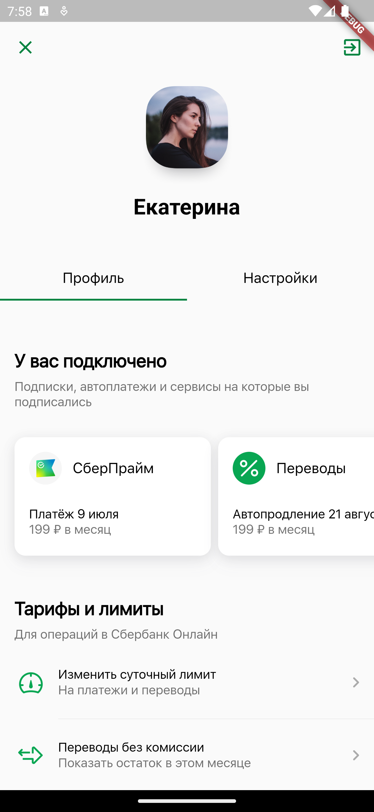
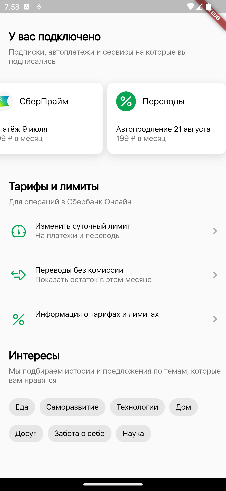

<h1 align="center">Flutter Sber App<h1>

- Flutter version: 3.13.6
- Dart version: 3.1.3

Screenshots:

Теперь о проблеммах и на русском.

При сборке приложения в релиз apk, область основного ListView, в ProfileScreen - серая, нагуглил решения, везде рекомендуют прописать в андройд манифесте доступ к интернету. Прописал, не помогло. Проект перекопал, объяснения этому так и не нашел
